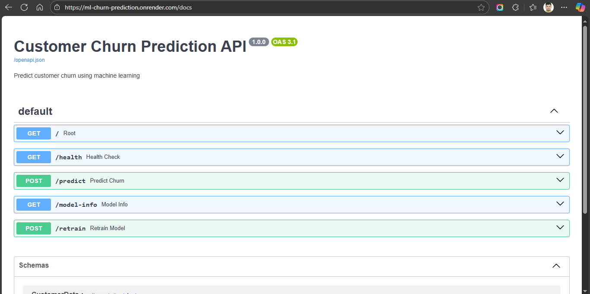
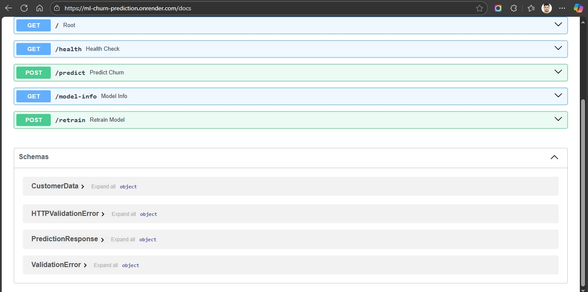

# Customer Churn Prediction API


An end-to-end machine learning project that serves a customer churn prediction model via a RESTful API built with FastAPI. This project is containerized using Docker for easy deployment and scalability on platforms like Render or Railway.

---

## Live Demo

Try it now: [https://ml-churn-prediction.onrender.com/docs](https://ml-churn-prediction.onrender.com/docs)

---

## 📋 Table of Contents

- [Key Features](#-key-features)
- [Tech Stack](#%EF%B8%8F-tech-stack)
- [Dataset](#-dataset)
- [Installation and Setup](#%EF%B8%8F-installation-and-setup)
- [Usage](#-usage)
- [API Endpoints](#-api-endpoints)
- [Example Request](#-example-request)
- [Deployment](#%EF%B8%8F-deployment)
- [Screenshots](#-screenshots)
- [Project Structure](#-project-structure)
- [Related Links](#-related-links)

---

## ✨ Key Features

- **Prediction API**: Exposes a Scikit-learn Random Forest model through a clean RESTful API.
- **Docker Support**: Comes with a `Dockerfile` for building and deploying as a portable container.
- **Model Retraining**: Includes an endpoint to trigger model retraining on new data.
- **Health Checks**: `GET /health` endpoint for monitoring and uptime checks.
- **Interactive Docs**: Automatic API documentation provided by FastAPI at the `/docs` endpoint.

---

## 🛠️ Tech Stack

- **Backend**: 🚀 FastAPI
- **ML Library**: 🧠 Scikit-learn & Pandas
- **Server**: 🦄 Uvicorn
- **Containerization**: 🐳 Docker
- **Deployment**: 🚂 Railway / Render

---

## 📊 Dataset

Customer Churn Prediction - Telco Customer Dataset

Download: [https://www.kaggle.com/datasets/blastchar/telco-customer-churn](https://www.kaggle.com/datasets/blastchar/telco-customer-churn)

Alternative: Use synthetic data generation script provided

---

## ⚙️ Installation and Setup

Follow these steps to set up the project locally.

### 1. Prerequisites

- Python 3.9
- Docker Desktop

### 2. Clone the Repository

```bash
git clone https://github.com/Adesh-Kumar-Sharma/ml-churn-prediction.git
cd ml-churn-prediction
```

### 3. Create a Virtual Environment

This project requires Python 3.9. Create a new virtual environment using the following command in bash:

```bash
python3.9 -m venv .venv
```

### 4. Activate the Environment

```bash
source .venv/bin/activate
```

### 5. Install Dependencies

Install all the required Python packages from requirements.txt:

```bash
python -m pip install -r requirements.txt
```

### 6. Download the dataset (Optional)

Download the Telco Customer Churn dataset from Kaggle and place it in the `data/` directory.
Then, unzip the dataset and rename the file to `telco_churn.csv`.

### 7. Train the Model

Run the training script to generate the machine learning model file (`churn_model.pkl`):

```bash
python train_model.py
```

---

## 🚀 Usage

You can run the API either directly with Uvicorn or inside a Docker container.

### 1. Local Development Server

To run the app with hot-reloading enabled:

```bash
uvicorn app:app --reload
```

The API will be available at [http://127.0.0.1:8000](http://127.0.0.1:8000). You can access the interactive documentation at [http://127.0.0.1:8000/docs](http://127.0.0.1:8000/docs).

### 2. Using Docker

Build the Docker Image:

```bash
docker build -t churn-api .
```

OR

```bash
sudo docker build -t churn-api .
```

Run the Docker Container:

```bash
docker run -p 8000:8000 churn-api
```

OR

```bash
sudo docker run -p 8000:8000 churn-api
```

The API will be accessible on your host machine at [http://localhost:8000](http://localhost:8000).

---

## 🔌 API Endpoints

| Method | Endpoint      | Description                                   |
|--------|--------------|-----------------------------------------------|
| GET    | `/`          | Displays a welcome message and API information|
| POST   | `/predict`   | Predicts customer churn based on input data   |
| GET    | `/health`    | Returns a 200 OK status for health checks     |
| GET    | `/model-info`| Provides information about the current model  |
| POST   | `/retrain`   | Triggers a model retraining process           |

---

## 📝 Example Request

Here's how you can make a prediction using Python's requests library:

```python
import requests

# The URL of your running API
url = "http://localhost:8000/predict"

# Example customer data
customer_data = {
   "tenure": 12,
   "MonthlyCharges": 85.0,
   "TotalCharges": 1020.0,
   "Contract": "Month-to-month",
   "PaymentMethod": "Electronic check",
   "InternetService": "Fiber optic",
   "OnlineSecurity": "No",
   "TechSupport": "No"
}

# Make the POST request
response = requests.post(url, json=customer_data)

# Print the result
print(response.json())
```

Expected Output:

```json
{
  "prediction": "Yes",
  "churn_probability": 0.67
}
```

---

## ☁️ Deployment

This application is ready for deployment on any platform that supports Docker containers, such as Render or Railway. Simply connect your GitHub repository and point the service to this project's Dockerfile.

---

## 📷 Screenshots




---

## 📁 Project Structure

```structure
.
├── app.py              # Main FastAPI application
├── train_model.py      # Script to train and save the model
├── model/
│   └── churn_model.pkl # Saved machine learning model
├── data/
│   └── telco_churn.csv # Dataset (optional, can be downloaded)
├── Dockerfile          # Docker configuration
├── requirements.txt    # Python dependencies
└── README.md           # This file
```

---

## 🔗 Related Links

- Next.js frontend repo — [https://github.com/Adesh-Kumar-Sharma/ml-churn-frontend](https://github.com/Adesh-Kumar-Sharma/ml-churn-frontend)
- Next.js frontend website — [https://ml-churn-frontend.vercel.app](https://ml-churn-frontend.vercel.app)
- FastAPI backend repo — [https://github.com/Adesh-Kumar-Sharma/ml-churn-prediction](https://github.com/Adesh-Kumar-Sharma/ml-churn-prediction)
- FastAPI backend docs website — [https://ml-churn-prediction.onrender.com/docs](https://ml-churn-prediction.onrender.com/docs)

---
